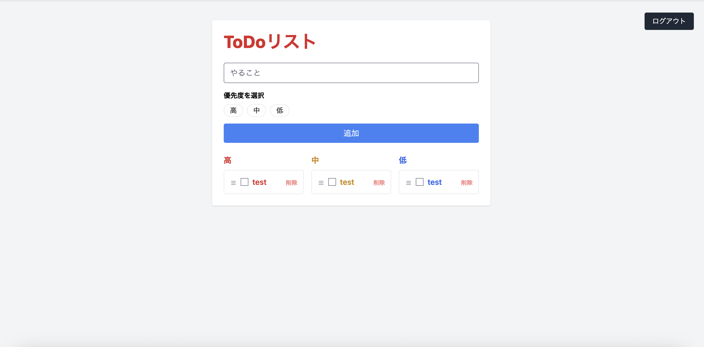

# Laravel + Tailwind CSS Todo App

Laravel と Tailwind CSS を使って作成した、学習用の Todo 管理アプリです。
プログラミング学習初心者が、

-   Laravel の基本構造を理解する
-   実際に動く Web アプリを作る
-   GitHub / デプロイまで一通り経験する

ことを目的として作成しました。

---

## このアプリについて

このアプリでは、以下のようなことができます。

-   Todo（やること）を追加する
-   優先度（高・中・低）ごとに自動でグループ分けして表示
-   チェックを入れて完了／未完了を切り替え
-   ドラッグ＆ドロップで並び替え・優先度の移動
-   Todo を削除
-   ログインユーザーごとに Todo を管理

「Laravel の基本 + 少しだけフロント操作（JavaScript）」を体験できる構成になっています。

---

## 公開 URL（Render）

https://laravel-tailwind-todo.onrender.com/todos

※ Render の無料プランを使用しているため、
初回アクセス時は起動に少し時間がかかる場合があります

---

## 機能一覧

| 機能         | 内容                                        |
| ------------ | ------------------------------------------- |
| Todo 追加    | やること・優先度を登録                      |
| Todo 一覧    | 優先度（高・中・低）ごとに表示              |
| 完了切替     | チェックで完了／未完了を切り替え            |
| ドラッグ移動 | Todo をドラッグで並び替え・枠をまたいで移動 |
| 優先度変更   | ドラッグ移動時に優先度が自動で更新          |
| 削除         | Todo を削除                                 |
| 認証         | ログインユーザーごとに Todo を管理          |

---

## UI の工夫ポイント

-   優先度ごとに色分け（高：赤 / 中：黄 / 低：青）
-   ドラッグハンドルを用意し、誤操作を防止
-   ドラッグ後は 即座に色・優先度が反映
-   完了時は 打ち消し線 + グレー表示

---

## 使用技術

-   Laravel 12
-   PHP 8.4
-   SQLite
-   Tailwind CSS
-   JavaScript（SortableJS）
-   Vite
-   Git / GitHub
-   Render（デプロイ）

---

## アプリ構成（初心者向け説明）

### Model（データを扱う）

-   `app/Models/Todo.php`
    Todo のデータ構造やデータベースとのやり取りを担当します。

---

### Controller（処理の中心）

-   `app/Http/Controllers/TodoController.php`
    画面表示、Todo の追加・更新・削除、並び替え処理をまとめています。

---

### View（画面）

-   `resources/views/todos/index.blade.php`
    Todo 一覧画面

-   `resources/views/todos/_item.blade.php`
    Todo 1 件分の表示を共通パーツとして切り出しています。

---

### JavaScript（画面操作）

-   `resources/js/todo.js`
    ドラッグ＆ドロップ、チェック操作、即時 UI 更新を担当しています。

---

### Route（URL と処理の対応）

-   `routes/web.php`
    URL と Controller の処理を結びつけています。

---

## 🚀 デプロイについて

-   Render を使用してアプリを公開
-   Docker を利用して Laravel 環境を構築
-   本番環境では `APP_DEBUG=false` に設定

「ローカルで作る → GitHub → 本番公開」まで一通り経験しました。

---

## 🖼 スクリーンショット

---

## 📚 学習して理解できたこと

-   Laravel の基本的な CRUD の流れ
-   ルーティング・Controller・View の役割分担
-   認証ユーザーとデータを紐付ける考え方
-   Blade テンプレートの使い方
-   JavaScript での UI 状態管理
-   ドラッグ＆ドロップ処理の実装方法
-   GitHub を使ったコード管理
-   Web アプリを実際に公開するまでの流れ

---

## 作成者

mami mitome

Laravel / PHP を中心にプログラミングを学習中。
「理解しながら手を動かす」ことを大切にしています。
